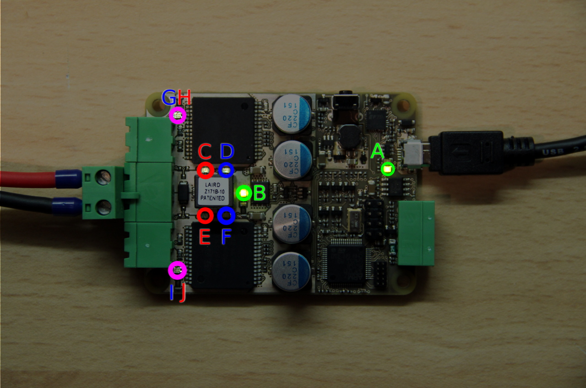

Student Robotics MCv4b Manufacture Test Procedure[^1]
===============================================

Test Jig Setup
==============

1. Connect power cable to bench power supply
2. Set bench power supply to 12V with 100mA current limit
3. Plug power cable into laptop
4. Plug USB cable into laptop
5. Turn laptop on. It will automatically run the test program.

Board Test Procedure
==================

1. Plug power cable into middle socket on board
2. Plug USB cable into USB socket on board
3. Green LED A, next to the USB socket, must illuminate
4. Turn on bench power supply
5. The board must not draw more than 40mA and green LED B must illuminate
6. Press enter on the laptop
7. The laptop must report that it has found the board
8. Press the push button on the side of the board
9. Press enter on the laptop
10. The laptop must report that it has succesfully flashed the board
11. Two red (C, E), two blue (D, F) and two red/blue bi-colour (G, H, I, J) LEDs must flash in turn. They will flash in the sequence C, D, E, F, G, H, I, J

